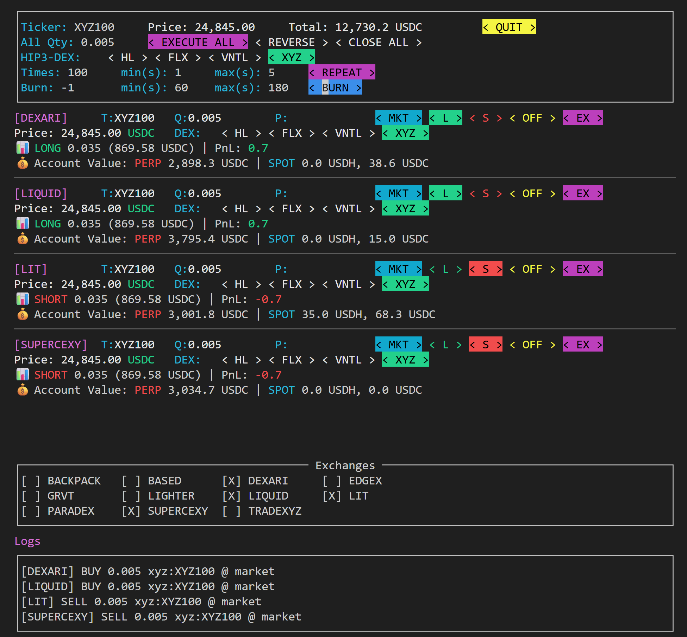

# Hyperliquid Multi‑DEX Trader (urwid TUI)


여러 Hyperliquid 엔진 기반 Perp DEX + mpdex 기반 비‑HL DEX(Lighter/Paradex/Edgex/GRVT/Backpack)를 하나의 터미널 UI(urwid)에서 동시에 거래하는 앱입니다.

- GitHub: https://github.com/NA-DEGEN-GIRL/perp_dex_hedge
- 기본 UI: urwid (경량·빠름·안정) — 앞으로도 urwid 중심으로 개발합니다.
- Textual: 더 이상 권장하지 않으며 레거시 옵션입니다. (`python main.py --ui textual`)

---

## 기능 요약

- 다수의 DEX(HL + 비‑HL) 동시 거래
- 현재가(공유·HL), 총 담보(USDC), 포지션/PNL 실시간 표시
- Market/Limit, Long/Short, 개별 실행(EX), 전체 실행(EXECUTE ALL), 방향 반전(REVERSE)
- OFF(비활성) 토글: EXECUTE ALL 대상 제외(기본 OFF)
- REPEAT: “횟수 × a~b초 랜덤 간격” 반복 실행(재클릭 시 즉시 중단)
- BURN: REPEAT 기반, 방향을 번갈아 2배 횟수로 반복 실행(파밍 보조)
- CLOSE ALL: 활성 거래소 포지션을 시장가 반대주문으로 0(청산)
- Exchanges 박스: show=False 거래소도 실행 중 표시/숨김 전환
- 키보드 중심 조작(Tab/Shift+Tab/영역 전환), 파일 로그(`debug.log`)

---

## 0. 사전 준비

- Python 3.10+ (Windows는 fastecdsa 의존성으로 3.10 권장)
- Git
- 지원 OS: Linux, macOS, WSL(Windows)

확인:
```bash
python --version   # 또는 python3 --version
git --version
```

---

## 1. 설치

```bash
git clone https://github.com/NA-DEGEN-GIRL/perp_dex_hedge
cd perp_dex_hedge

# 가상환경
python3 -m venv .venv
source .venv/bin/activate    # Windows PowerShell: .\.venv\Scripts\Activate.ps1

# 의존성 (HL용 ccxt + urwid + mpdex까지 포함)
pip install -r requirements.in
```

requirements.in(발췌):
```
python-dotenv
urwid
msgpack
mpdex @ git+https://github.com/NA-DEGEN-GIRL/multi-perp-dex.git@master
```

---

## 2. 설정

### A) .env (지갑/키)
```bash
cp .env.example .env
```

아래 키를 거래소별로 채웁니다(섹션명을 대문자 접두사로).

```env
# Trade.xyz (일반 Hyperliquid 경로, 빌더코드 미사용 예시)
TRADEXYZ_WALLET_ADDRESS=0x...
TRADEXYZ_AGENT_API_KEY=
TRADEXYZ_PRIVATE_KEY=0x...

# Lit (일반 Hyperliquid 경로)
LIT_WALLET_ADDRESS=0x...
LIT_AGENT_API_KEY=
LIT_PRIVATE_KEY=0x...

# Dexari (HL)
DEXARI_WALLET_ADDRESS=0x...
DEXARI_AGENT_API_KEY=
DEXARI_PRIVATE_KEY=0x...

# Liquid (HL)
LIQUID_WALLET_ADDRESS=0x...
LIQUID_AGENT_API_KEY=
LIQUID_PRIVATE_KEY=0x...

# Supercexy (HL)
SUPERCEXY_WALLET_ADDRESS=0x...
SUPERCEXY_AGENT_API_KEY=
SUPERCEXY_PRIVATE_KEY=0x...

# BasedOne (HL)
BASEDONE_WALLET_ADDRESS=0x...
BASEDONE_AGENT_API_KEY=
BASEDONE_PRIVATE_KEY=0x...

# Superstack (HL, 자체 지갑 provider 사용)
# 지갑 주소는 HL 주소를 사용하며, API 키는 superstack 포털에서 발급
SUPERSTACK_WALLET_ADDRESS=0x...
SUPERSTACK_API_KEY=sk_...

# ===== Lighter (mpdex) =====
# account_id 확인:
# 1) https://app.lighter.xyz/explorer → 본인 주소 → 거래 상세의 account_index
# 2) https://apidocs.lighter.xyz/reference/account-1 → by=l1_address, value=본인 EVM 주소 → "Try it!" → account_index
# api key: https://app.lighter.xyz/apikeys (api_key_id는 보통 2부터 사용)
LIGHTER_ACCOUNT_ID=transaction_에서_확인
LIGHTER_PRIVATE_KEY=api_생성시_확인
LIGHTER_API_KEY_ID=api_생성시_확인
LIGHTER_L1_ADDRESS=your_evm_address

# ===== Paradex (mpdex) =====
PARADEX_L1_ADDRESS=your_evm_address
PARADEX_ADDRESS=paradex_접속시_표시
PARADEX_PRIVATE_KEY=paradex에서_확인

# ===== Edgex (mpdex) =====
EDGEX_ACCOUNT_ID=your_account_id
EDGEX_PRIVATE_KEY=https://pro.edgex.exchange/keyManagement에서_확인(신청_필요)

# ===== GRVT (mpdex) =====
GRVT_API_KEY=https://grvt.io/exchange/account/api-keys에서_발급
GRVT_ACCOUNT_ID=your_account_id
GRVT_SECRET_KEY=https://grvt.io/exchange/account/api-keys에서_발급

# ===== Backpack (mpdex) =====
BACKPACK_API_KEY=https://backpack.exchange/portfolio/settings/api-keys에서_발급
BACKPACK_SECRET_KEY=https://backpack.exchange/portfolio/settings/api-keys에서_발급
```

- HL은 Agent API Key(또는 Private Key)를 사용합니다(Private Key 직접 사용은 비권장).
- superstack은 HL이지만, exchange=superstack으로 설정합니다(아래 B) 참고). 주문 서명은 지갑 provider API를 통해 처리합니다.
- 비‑HL(mpdex) 거래소는 .env만 맞으면 추가 설정 없이 동작합니다(내부에서 심볼 변환 symbol_create 사용).

### B) config.ini (표시/엔진/수수료)
```ini
# - HL: 섹션에 exchange 키가 없음(순수 Hyperliquid 경로)
# - superstack: exchange=superstack (HL-like, 지갑 provider 서명)
# - 비‑HL(mpdex): exchange=< lighter | paradex | edgex | grvt | backpack >

# 일반 Hyperliquid 엔진 (빌더코드 없이 호출하는 기본 경로)
[tradexyz]
show = False
# 설명: tradexyz 섹션은 특정 HIP-3 DEX를 지정하지 않는, 일반 HL 접속 예시입니다.

# HL: Lit (일반 HL + 빌더코드 예시)
[lit]
builder_code = 0x24a747628494231347f4f6aead2ec14f50bcc8b7
fee_rate = 20 / 25         ; limit / market
dex_fee_rate = 30 / 50     ; (선택) HIP-3 공통 DEX 수수료, 없으면 fee_rate 사용
show = True
FrontendMarket = True

# HL: Dexari
[dexari]
builder_code = 0x7975cafdff839ed5047244ed3a0dd82a89866081
fee_rate = 10 / 10
show = True
# fee_rate 본인 tier에 따라 다름 10~50 까지, 확인하고 고쳐 쓰기

# HL: Liquid
[liquid]
builder_code = 0x6D4E7F472e6A491B98CBEeD327417e310Ae8ce48
fee_rate = 50 / 50
show = True

# HL: BasedOne
[based]
builder_code = 0x1924b8561eef20e70ede628a296175d358be80e5
fee_rate = 25 / 25
show = False
FrontendMarket = True

# HL: Supercexy
[supercexy]
builder_code = 0x0000000bfbf4c62c43c2e71ef0093f382bf7a7b4
fee_rate = 15 / 16
dex_fee_rate = 1 / 1        ; HIP-3 공통 수수료(예: xyz/flx/vntl)
show = True
FrontendMarket = True

[superstack]
builder_code = 0xcdb943570bcb48a6f1d3228d0175598fea19e87b
fee_rate = 4 / 11
show = True
FrontendMarket = True
exchange = superstack       ; need!

# 비‑HL(mpdex)
[lighter]
show = False
exchange = lighter

[edgex]
show = False
exchange = edgex

[paradex]
show = False
exchange = paradex

[grvt]
show = False
exchange = grvt

[backpack]
show = False
exchange = backpack
```

- show=True: 기본 표시, False: 기본 숨김(OFF 간주)
  - fee_rate = L / M
    - 메인 HL(DEX 미선택) 주문에 적용되는 기본 수수료(빌더 단위, 정수).
  - dex_fee_rate = L / M
    - HIP‑3 DEX 주문의 “공통 기본값”. 설정이 없으면 HIP‑3 주문도 fee_rate를 사용합니다.
  - 개별 DEX 우선 적용: xyz_fee_rate, vntl_fee_rate, flx_fee_rate 등의 항목이 있으면 해당 DEX 주문에 최우선으로 적용됩니다.
  - 정리(우선순위): HIP‑3 주문 시 “개별 DEX” → “dex_fee_rate” → “fee_rate”.
- builder_code를 설정하지 않으면 빌더/fee는 주문 payload에 포함되지 않습니다(기본 빌더주소 주입 없음).
  - superstack는 **exchange=superstack**로 지정합니다(주문 서명은 provider API).

---

## 3. 실행

```bash
python main.py
```

---

### 4‑1. 헤더(공통 옵션: Common Options)
행 구성  
1) Ticker / Price / Total / QUIT  
2) All Qty / EXECUTE ALL / REVERSE / CLOSE ALL  
2.5) HIP3‑DEX (HL 전용)  
3) REPEAT: Times / min(s) / max(s) / [REPEAT]  
4) BURN: Burn / min(s) / max(s) / [BURN]

- Ticker
  - 공통 심볼 입력(기본 BTC). 입력 후 약 0.4초 뒤 자동 반영됩니다.
  - HL에서는 심볼 반영 시 거래소별 “최대 레버리지/마진 모드”를 자동 보장(1회)합니다.
  - HIP‑3(빌더 DEX)를 헤더에서 선택한 경우, Ticker에는 “코인만” 입력(예: XYZ100)하면 내부에서 ‘xyz:XYZ100’로 합성되어 동작합니다.

- Price
  - HL: metaAndAssetCtxs 기반 3초 캐시(모든 HL 카드가 공유)로 표시됩니다.
  - 비‑HL: 각 카드에서 개별적으로 표시됩니다(자세한 내용은 아래 4‑2).

- Total
  - 모든 거래소 담보(accountValue) 합계(USDC)입니다. HL은 clearinghouseState의 accountValue(메인+모든 HIP‑3)를 합산합니다.

- QUIT
  - 앱 종료(백그라운드 태스크도 안전하게 정리).

- All Qty / EXECUTE ALL / REVERSE / CLOSE ALL
  - All Qty: 화면에 표시된 모든 거래소 카드의 Q(수량)에 일괄 적용.
  - EXECUTE ALL: 활성(L 또는 S 선택)된 거래소만 동시에 주문합니다. OFF인 카드는 제외됩니다.
  - REVERSE: 활성 + 방향 선택된 거래소에 한하여 LONG↔SHORT 일괄 반전.
  - CLOSE ALL: 활성 거래소 포지션을 시장가 reduceOnly로 청산(0으로 만듭니다).

- HIP3‑DEX (HL 전용)
  - 기본값은 HL(일반 Hyperliquid). UI에 빌더 DEX 목록(예: xyz, flx, vntl)이 버튼으로 표시됩니다.
  - 헤더에서 HIP‑3 DEX를 선택하면 Ticker에는 “코인만” 입력합니다(예: XYZ100 → 내부적으로 ‘xyz:XYZ100’).
  - 헤더에서 선택 시 모든 HL 카드에 일괄 적용됩니다(각 카드에서 개별 덮어쓰기 가능).

- REPEAT: Times / min(s) / max(s) / [REPEAT]
  - Times: 반복 횟수(정수 ≥ 1).
  - min(s)/max(s): 반복 사이 대기(초). 매 회 랜덤(min~max)로 대기합니다.
  - [REPEAT]: 클릭 시 EXECUTE ALL을 Times회 반복 실행. 실행 중 다시 누르면 즉시 중지(다음 주문부터 멈춤).

- BURN: Burn / min(s) / max(s) / [BURN]
  - Burn=1: REPEAT와 동일.
  - Burn≥2: REPEAT(Times) → burn 대기 → 방향 반전 → REPEAT(2×Times) → … (Burn회 반복).
  - 예: Times=5, Burn=3, 시작이 LONG이면 “LONG×5 → 대기 → SHORT×10 → 대기 → LONG×10”.
  - 무한 반복: Burn=-1.
  - [BURN]: 실행/중지 토글(중지 시 다음 라운드부터 멈춤).

참고
- HL + FrontendMarket=True이며 주문 유형이 “시장가”인 경우, HL RAW 경로로 전송되어 tif='FrontendMarket'으로 마킹됩니다(즉시 체결 성격, 슬리피지 적용).
- 시장가 주문에서 가격 입력은 무시됩니다(가격은 내부 가격 소스에서 산정).

---

### 4‑2. 거래소 카드(한 거래소당 1장)
행 구성  
- 1행: [거래소명] T(코인) Q P MKT/LMT L S OFF EX  
- 2행: Price(현재가) [ + (HL 전용) HIP3‑DEX 버튼(오른편) ]  
- 3행: 📘 Position | 💰 Collateral

1행(주문 입력/버튼)
- T(코인): 그 카드에서 사용할 심볼.
  - HIP‑3를 카드에서 선택한 경우(2행 오른편 DEX 버튼), “코인만” 입력합니다(예: XYZ100 → 내부적으로 ‘xyz:XYZ100’).

- Q(수량) / P(가격) / MKT/LMT
  - MKT(시장가): 카드별 가격 소스(아래 Price)를 사용하므로 P는 무시됩니다.
  - LMT(지정가): P(가격) 필수.

- L/S/OFF/EX
  - L: LONG 선택(초록 강조, 카드 활성).
  - S: SHORT 선택(빨강 강조, 카드 활성).
  - OFF: 카드 비활성(노란 강조). EXECUTE ALL/CLOSE ALL 대상에서 제외.
  - EX: 해당 카드만 즉시 주문 실행.

2행(가격/DEX)
- Price(현재가)
  - HL: metaAndAssetCtxs 기반 캐시(3초)에서 해당 카드의 DEX/코인 가격 표시.
  - 비‑HL(mpdex): exchange.get_mark_price(nativeSymbol)로 표시.
- HIP3‑DEX(오른편, HL 전용)
  - 카드별로 DEX를 HL/XYZ/FLX/VNTL 등으로 지정합니다. HL 카드에만 보입니다.
  - XYZ: unit에서 운영 / FLX: felix에서 운영 / VNTL: ventuals에서 운영
  - **FLX 및 VNTL의 경우 USDH가 spot에 있어야 거래가 가능**
  - Price와 DEX를 한 줄로 배치(왼쪽 Price(가변), 오른쪽 DEX 버튼 행).

3행(상태)
- 📘 Position
  - 방향/사이즈/PNL. 사이즈 옆에 “(사이즈×현재가)” USDC 값도 함께 표시합니다(각 카드의 가격 사용).
    - HIP‑3 포맷의 키(예: ‘xyz:XYZ100’)는 내부에서 대소문자 정규화가 적용되어 ‘xyz:XYZ100’/‘XYZ:XYZ100’ 어느 형태로 입력해도 포지션이 올바르게 표시됩니다.

- 💰 Collateral
  - HL: clearinghouseState.accountValue(메인+모든 HIP‑3 합산)에 기반합니다.
  - 비‑HL: 거래소가 제공하는 collateral/잔고 정보를 사용합니다.

주문 동작(핵심 요약)
- HL(메인/HIP‑3) 모두 RAW 주문으로 통합
  - 자산 ID: allPerpMetas 캐시로 계산(메인: index, HIP‑3: 100000 + dexIdx×10000 + localIdx)
  - 가격/사이즈: metaAndAssetCtxs의 szDecimals 기반 Perp 규칙 적용
    - Size: szDecimals로 반올림
    - Price: 소수자릿수 ≤ 6−szDecimals, 소수인 경우 유효숫자 ≤ 5자리(정수는 제한 없음)
  - 시장가: 슬리피지 적용, FrontendMarket 옵션 ON일 때만 tif='FrontendMarket'
- 비‑HL(mpdex)
  - Market: price 없이 실행
  - Limit: price 필수
  - 심볼은 symbol_create(exchange, coin)로 변환하여 사용

---

### 4‑3. Exchanges 박스(하단)
- 모든 거래소를 체크박스로 3줄 정렬합니다.
- ON(체크): 카드가 생성되고 상태 루프 시작.
- OFF: 카드가 숨겨지고 해당 루프 취소(네트워크 요청 감소).
- config.ini의 show 기본값과 무관하게 실시간 토글 가능합니다.

---

### 4‑4. 키보드(요약)
- 영역 전환: Shift+Up/Down
- 내부 이동: Tab/Shift+Tab(입력·버튼만 순회), 방향키
- 래핑
  - EX → Tab → 다음 카드의 Q
  - Q → Shift+Tab → 이전 카드의 EX

---

## 5. 로그/디버깅

- 파일 로그: `debug.log`(UTF‑8 텍스트)
- 콘솔 로그는 기본 비활성(urwid 화면 보전). 필요 시 `PDEX_LOG_CONSOLE=1`로 임시 활성화.

---

## 6. 보안 주의

- `.env`는 절대 커밋/공유 금지
- 가능한 Agent API Key(또는 mpdex API 키) 사용(Private Key 직접 사용 지양)
- 서버/CI 배포 시 파일 권한/접근 제어 철저

---

## 7. 기술 스택

- UI: urwid(기본), Textual(레거시)
- 거래소 API: hyperliquid api, mpdex(Lighter/Paradex/Edgex/GRVT/Backpack)
- 설정: python‑dotenv, configparser

---

## 8. 로드맵

- ✅ urwid UI 안정화 / HL 가격 공유 / Exchanges 토글
- ✅ REPEAT 즉시 중단 / Tab·Shift+Tab 탐색 안정화
- ✅ CLOSE ALL / BURN 기능
- ✅ 비‑HL(mpdex) 거래소: Lighter/Paradex/Edgex/GRVT/Backpack 연동
- ✅ XYZ 지원
- ✅ FLX / VNTL 지원 (USDH 페어)
- ✅ spot USDC 잔고 표기
- 🔜 USDC <-> USDH swap 편의기능
- 🔜 비‑HL(mpdex) 거래소: Pacifica/Variational 연동
- 🔜 limit 오더 관리