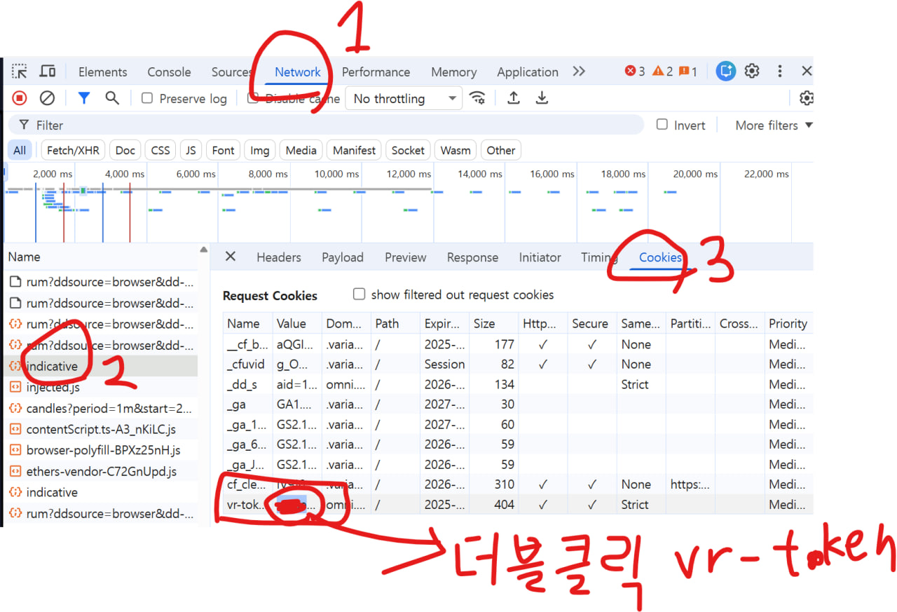
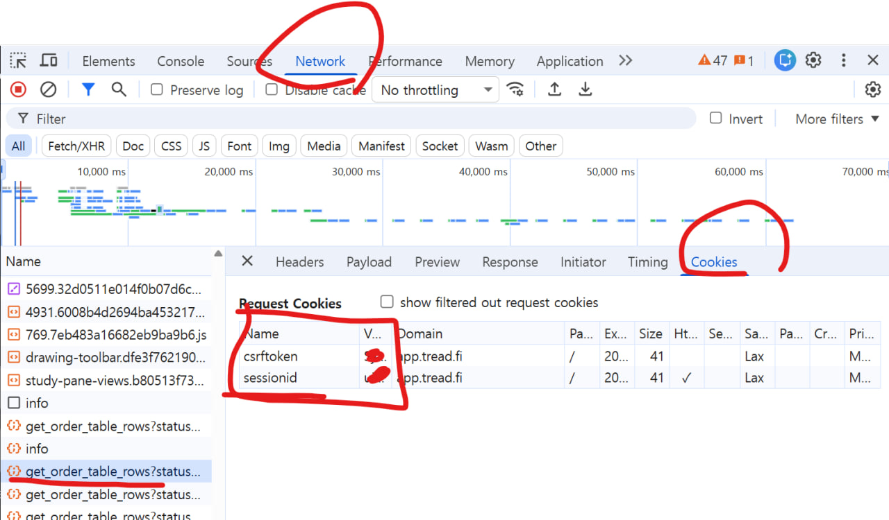

> ⚠️ 중요 고지(필독) — 안전/책임/한계
>
> - 이 저장소의 코드는 “코딩 초보”가 학습/개인 용도로 만든 실험적 프로그램입니다. 상업적/전문적 품질을 보장하지 않으며, 모든 사용은 전적으로 본인 책임입니다.  
> - 본 프로젝트는 “있는 그대로(as‑is)” 제공되며, 명시적/묵시적 보증이 없습니다. 본 소프트웨어를 사용/배포/수정함으로써 발생하는 모든 손실(자산 손실, 기회 손실, 시스템 장애, 법적 분쟁 등)에 대해 작성자는 책임지지 않습니다.
> - 금융/투자 조언이 아닙니다. 거래는 반드시 “소액”으로 테스트 후 사용하세요. 시장가(MKT)·반복 실행(REPEAT/BURN)·일괄 실행(EXECUTE ALL) 기능은 특히 주의가 필요합니다.
> - 민감 정보(.env의 지갑/키/세션)는 절대 공개/커밋/공유 금지. 실행 파일(.exe) 안에 포함하지 마세요. 프로그램은 exe 옆/현재 폴더의 .env·config.ini를 “외부에서” 읽습니다.
> - 키 보관 원칙: 가능하면 “프라이빗키” 대신 에이전트/API 키 사용을 권장합니다. 프라이빗키를 사용할 경우 오프라인 백업/암호보호/권한관리(파일 권한, 사용자 계정) 필수입니다.
> - 로그 파일(debug.log, ws.log 등)에 민감 데이터(주소/오류 메시지)가 포함될 수 있습니다. 공유 전 반드시 확인/편집하세요.
> - 하이브리드(treadfi.hyperliquid)·서브계정(vaultAddress)·HIP‑3(DEX) 등 특수 경로는 거래소 정책/업데이트에 의해 언제든 실패/변경될 수 있습니다.
> - Windows 단일 실행 파일(.exe)은 서명되지 않았습니다. 백신/보안정책에 따라 경고가 뜰 수 있습니다. 신뢰할 수 있는 환경에서만 실행하세요.
>
> 사용 전 체크리스트  
> 1) .env에 “사용할 거래소만” 남기고 키/주소 입력(나머지는 지우기)  
> 2) config.ini에서 해당 섹션 `show=True`, `exchange=` 값 확인  
> 3) `python main.py` 또는 PerpDexHedge.exe로 실행 → debug.log 확인  
> 4) “아주 작은 수량”으로 시장가 번 테스트 후 사용
> 5) 큰 금액을 넣어서 하지마세요. 어떤 버그가 있을지 모르니 본인이 감당가능한 선에서 돌리세요.

# Hyperliquid Multi‑DEX Trader


여러 Hyperliquid 엔진 기반 Perp DEX + mpdex 기반 비‑HL DEX(Lighter/Paradex/Edgex/GRVT/Backpack/Variational)를 하나의 UI에서 동시에 거래하는 앱입니다.

- GitHub: https://github.com/NA-DEGEN-GIRL/perp_dex_hedge

---

## 지원 거래소
- hyperliquid 기반: 옵션으로 추가 가능, builder code와 fee만 알면됩니다.
  - 기본제공: mass, lit, dexari, liquid, based, supercexy, bullpen, dreamcash
  - hyperliquid 기반이지만 특수 케이스: superstack, treadfi_hl
- 비 hyperliquid 거래소들: lighter, liquid-lighter, edgeX, paradex, grvt, backpack, variational, pacifica

---

## 기능 요약

- 다수의 DEX(HL + 비‑HL) 동시 거래
- 현재가(공유·HL), 총 담보(USDC), 포지션/PNL 실시간 표시
- Market/Limit, Long/Short, 개별 실행(EX), 전체 실행(EXECUTE ALL), 방향 반전(REVERSE)
- OFF(비활성) 토글: EXECUTE ALL 대상 제외(기본 OFF)
- REPEAT: “횟수 × a~b초 랜덤 간격” 반복 실행(재클릭 시 즉시 중단)
- BURN: REPEAT 기반, 방향을 번갈아 2배 횟수로 반복 실행(파밍 보조)
- CLOSE ALL: 활성 거래소 포지션을 시장가 반대주문으로 0(청산)
- Exchanges 박스: show=False 거래소도 실행 중 표시/숨김 전환
- 키보드 중심 조작(Tab/Shift+Tab/영역 전환), 파일 로그(`debug.log`)

---

## 0. 사전 준비

- **윈도우에서 Lighter 사용할거면 파이썬 3.10 사용**
- 제발 좀 읽어 시발
- Python 3.10+ (Windows는 fastecdsa 의존성으로 3.10 권장)
- Git
- 지원 OS: Linux, macOS, WSL(Windows)

## 0‑1. Windows: Git / Python 3.10 설치(초보용)

가장 쉬운 방법(권장): PowerShell에서 winget으로 설치합니다.  
PowerShell을 “관리자 권한”으로 실행한 뒤, 아래를 그대로 복사/붙여넣기 하세요.

```powershell
# 1) Git 설치
winget install -e --id Git.Git

# 2) Python 3.10 설치(권장: 3.10.x)
winget install -e --id Python.Python.3.10

# 3) 설치 확인(아래처럼 버전이 보이면 성공)
python --version   # 또는 python3 --version
git --version
```

설치 시 체크 포인트
- Python 설치 마법사에서 “Add python.exe to PATH(경로 추가)” 옵션을 체크하면 편합니다.
- “Disable path length limit(경로 길이 제한 해제)”가 보이면 체크해 주세요(빌드 오류 예방).

winget이 안 될 때(대안)
- Git: https://git-scm.com/download/win 에서 설치 파일 다운로드 → 기본값으로 설치 → `git --version` 확인
- Python 3.10: https://www.python.org/downloads/ 에서 3.10.x 다운로드 → 설치 시 PATH 옵션 체크 → `py -V` 확인
  - 이 프로젝트는 일부 의존성(fastecdsa 등) 때문에 Windows에서는 “3.10”을 권장합니다.

설치가 끝나면, 아래 “**초보용**: Windows 스크립트만 실행해서 설치/업데이트/실행하기” 섹션으로 바로 이동하세요.

---

## 1. 최저 지능이 있는 사람의 경우 설치방법

```bash
git clone https://github.com/NA-DEGEN-GIRL/perp_dex_hedge
cd perp_dex_hedge

# 가상환경 (모르면 gpt 검색 제발)
python3 -m venv .venv
source .venv/bin/activate    # Windows PowerShell: .\.venv\Scripts\Activate.ps1

# 의존성 (HL용 ccxt + urwid + mpdex까지 포함)
pip install -r requirements.in
```

requirements.in(발췌):
```
python-dotenv
urwid
msgpack
mpdex @ git+https://github.com/NA-DEGEN-GIRL/multi-perp-dex.git@master
PySide6
qasync
```

## 1.1 **지능이 없는 다슬기용**: Windows 스크립트만 실행해서 설치/업데이트/실행하기

파이썬만 설치되어 있다고 가정합니다. 아래 3개 스크립트만 기억하세요.

- 최초 설치: `.\scripts\win\setup.ps1`
- 강제 업데이트(충돌 무시): `.\scripts\win\update-force.ps1`
- 평소 실행: `.\scripts\win\run.ps1`

사전 1회 설정(실행 정책 오류 방지)
```powershell
# PowerShell을 “관리자 권한”으로 열고 1번만 실행
Set-ExecutionPolicy -Scope CurrentUser -ExecutionPolicy RemoteSigned -Force
```

### 1) 최초 설치(처음 한 번만)
```powershell
# 저장소 루트에서 실행
.\scripts\win\setup.ps1
```
- 하는 일: 가상환경(.venv) 생성 → pip 업그레이드 → 의존성 설치 → .env/.ini 기본 파일 준비 → 실행

### 2) 새 버전 업데이트(충돌 나도 그냥 되게)
```powershell
.\scripts\win\update-force.ps1
```
- 하는 일: .env, config.ini 등 “내 설정”을 백업 → 원격 기본 브랜치로 강제 동기화 → 내 설정 복원 → 새 .venv로 재설치 → 실행
- 백업 위치: `backup\YYYYMMDD_HHMMSS\` (문제 생기면 여기서 비교/복구)

### 3) 평소 실행
```powershell
.\scripts\win\run.ps1
```
- 하는 일: .venv이 없으면 자동 생성/설치 후 실행, 있으면 바로 실행

자주 묻는 질문
- “py를 찾을 수 없습니다” → 파이썬 설치 시 PATH 옵션을 켜세요. 임시로는 스크립트가 `python`으로 자동 폴백합니다.
- 실행이 차단됩니다 → 위 실행 정책 설정을 먼저 해주세요.

---

## 2. 설정

중요: `config.ini`의 `[섹션명]`은 “사용자 구분용 이름”입니다. **실제 엔진/백엔드 종류는 섹션 내부의 `exchange=` 값**으로 결정됩니다.  
또한 `.env`의 키 접두사는 “섹션명 대문자”로 맞춥니다. (예: `[lit]` → `LIT_*`, `[treadfi_hl]` → `TREADFI_HL_*`)

### A) .env (지갑/키)
```bash
cp .env.example .env
```

#### .env 작성 7원칙(초보자용)
1) 등호(=) 앞뒤에 공백 절대 금지  
   - 예) `A=B` (O) / `A = B` (X) / `A= B` (X) / `A =B` (X)

2) 값에 따옴표(" ' backtick) 금지  
   - 예) `KEY=1234` (O) / `KEY="1234"` (X) / `KEY='1234'` (X)

3) 주석(메모) 금지 — 줄 끝에도 쓰지 마세요  
   - 예) `A=1234` (O) / `A=1234 # 메모` (X)

4) 값에 공백(스페이스) 금지 — 필요하면 밑줄(_) 사용  
   - 예) `NAME=my_account` (O) / `NAME=my account` (X)

5) 키 이름은 대문자+밑줄 권장, 섹션명과 접두사 맞추기  
   - `[lit]` → `LIT_*`, `[treadfi_hl]` → `TREADFI_HL_*`

6) 불리언은 `1/0` 또는 `true/false` 사용(소문자 권장)  
   - 예) `HL_IS_SUB=1` 또는 `HL_IS_SUB=true`

7) 사용하지 않는 거래소 키는 “빈값”으로 두지 말고 줄 자체를 삭제  
   - 예) `VARIATIONAL_WALLET_ADDRESS=` (X) → 해당 줄 삭제 (O)

#### 올바른/잘못된 예시
```env
# 올바른 예 (O)
LIT_WALLET_ADDRESS=0xabc123...
HL_AGENT_API_KEY=0xdeadbeef...
HL_AGENT_PRIVATE_KEY=0xfeedface...
HL_IS_SUB=1
TREADFI_HL_ACCOUNT_NAME=my_account

# 잘못된 예 (X)
LIT_WALLET_ADDRESS = 0xabc123...      # 등호 양옆 공백
HL_AGENT_API_KEY="0xdeadbeef..."      # 따옴표
A=1234 # 메모                          # 주석
TREADFI_HL_ACCOUNT_NAME=my account    # 값에 공백
VARIATIONAL_WALLET_ADDRESS=           # 미사용 줄은 삭제 권장, 사실 빈값은 괜찮음
```

- 접두사 규칙: `[섹션명]` → 섹션명을 대문자로 바꿔 **ENV 접두사**로 사용합니다.
  - 예: `[lit]` → `LIT_WALLET_ADDRESS`, `[dexari]` → `DEXARI_PRIVATE_KEY`
  - 예: `[treadfi_hl]` → `TREADFI_HL_MAIN_WALLET_ADDRESS` …

- Sub Account (IS_SUB)
  - HL 계정이 “서브계정(sub account)”인 경우 `.env`에 `{NAME}_IS_SUB=1|true`를 설정하세요.
  - 효과: `vaultAddress`가 자동으로 `{NAME}_WALLET_ADDRESS`와 동일하게 설정되어 sub‑account 경로로 서명/전송됩니다.
  - Superstack에는 필요 없습니다(지갑 provider 사용).

- Tread.fi (treadfi.hyperliquid, tread.fi에서 hyperliquid 계정사용)
  - **조회(가격/포지션)**: Hyperliquid WS/Info API 그대로 사용
  - **주문**: tread.fi(front, mpdex) 백엔드로 전송
  - 필요한 .env 키(섹션명 `[treadfi_hl]` → 접두사 `TREADFI_HL_*`)

- **사용안할 거래소는 env에서 지워도 됨.**
- **설정 복잡해 보이면 그냥 있는거에다가 필요한것만 채우고 안쓰는 거래소 부분은 지우면됨**

```env
# HL (일반 Hyperliquid 경로, 빌더코드 미사용 예시)
HL_WALLET_ADDRESS="트레이딩하는 지갑 주소, sub-account 사용시 해당 주소 입력"
HL_AGENT_API_KEY="api 생성시 나오는 주소"
HL_AGENT_PRIVATE_KEY="api 생성시 빨간색으로 표시되어 나옴"
HL_IS_SUB=1   # ← 서브계정이면 1 or true 로 설정, 아닌경우 그냥 생략 가능

# Lit (HL)
LIT_WALLET_ADDRESS=0x...
LIT_AGENT_API_KEY=0x...
LIT_AGENT_PRIVATE_KEY=0x...

# Dexari (HL)
DEXARI_WALLET_ADDRESS=0x...
DEXARI_AGENT_API_KEY=0x...
DEXARI_AGENT_PRIVATE_KEY=0x...

# Liquid (HL)
LIQUID_WALLET_ADDRESS=0x...
LIQUID_AGENT_API_KEY=0x...
LIQUID_AGENT_PRIVATE_KEY=0x...

# Supercexy (HL)
SUPERCEXY_WALLET_ADDRESS=0x...
SUPERCEXY_AGENT_API_KEY=0x...
SUPERCEXY_AGENT_PRIVATE_KEY=0x...

# BasedOne (HL)
BASEDONE_WALLET_ADDRESS=0x...
BASEDONE_AGENT_API_KEY=0x...
BASEDONE_AGENT_PRIVATE_KEY=0x...

# Superstack (HL, 자체 지갑 provider 사용)
# 지갑 주소는 HL 주소를 사용하며, API 키는 superstack 포털에서 발급
SUPERSTACK_WALLET_ADDRESS=0x...
SUPERSTACK_AGENT_API_KEY=sk_...

# tread.fi with hyperliquid
TREADFI_HL_LOGIN_WALLET_ADDRESS="로그인할때 쓰는 주소" # 로그인 때문에 필요
TREADFI_HL_LOGIN_WALLET_PRIVATE_KEY="로그인 지갑 프빗키" # 생략 가능, 자동 로그인을 원하면 넣어도댐
TREADFI_HL_TRADING_WALLET_ADDRESS="거래 계정 주소" # 실제 주문이 들어갈 주소
TREADFI_HL_ACCOUNT_NAME="tread.fi 에서 하리 계정 생성시 이름" # 필요
TREADFI_HL_CSRF_TOKEN="쿠키설정" # 생략가능, 넣을시 로그인 따로 안함
TREADFI_HL_SESSION_ID="쿠키설정" # 생략가능, 넣을시 로그인 따로 안함

# Variational 
# 지갑 주소만 넣어도, http://127.0.0.1:7469/ 로컬서버에서 로그인 가능
# 깨름칙 한 경우 variational 사이트에서 접속후 cookie의 vr-token값을 입력 하면됨
# 굳이 private key를 안넣어도 되는데 다 귀찮으면 프빗키만 넣어도 되긴함
VARIATIONAL_WALLET_ADDRESS="지갑주소" # 반드시 필요
VARIATIONAL_JWT_TOKEN="session cookies의 vr-token값" # 생략가능, skip시 로그인창으로 로그인 해야함
VARIATIONAL_PRIVATE_KEY="지갑 프빗키" # 생략가능, 생략시 로그인창으로 로그인 해야함

# Pacifica
PACIFICA_PUBLIC_KEY="지갑주소"
PACIFICA_AGENT_PUBLIC_KEY="API지갑주소, API생성시나옴"
PACIFICA_AGENT_PRIVATE_KEY="API생성시 나옴"

# ===== Lighter (mpdex) =====
# account_id 확인:
# 1) https://app.lighter.xyz/explorer → 본인 주소 → 거래 상세의 account_index
# 2) https://apidocs.lighter.xyz/reference/account-1 → by=l1_address, value=본인 EVM 주소 → "Try it!" → account_index
# api key: https://app.lighter.xyz/apikeys (api_key_id는 보통 2부터 사용)
LIGHTER_ACCOUNT_ID=transaction_에서_확인
LIGHTER_PRIVATE_KEY=api_생성시_확인
LIGHTER_API_KEY_ID=api_생성시_확인
LIGHTER_L1_ADDRESS=your_evm_address

# ===== Paradex (mpdex) =====
PARADEX_L1_ADDRESS=your_evm_address
PARADEX_ADDRESS=paradex_접속시_표시
PARADEX_PRIVATE_KEY=paradex에서_확인

# ===== Edgex (mpdex) =====
EDGEX_ACCOUNT_ID=your_account_id
EDGEX_PRIVATE_KEY=https://pro.edgex.exchange/keyManagement에서_확인(신청_필요)

# ===== GRVT (mpdex) =====
GRVT_API_KEY=https://grvt.io/exchange/account/api-keys에서_발급
GRVT_ACCOUNT_ID=your_account_id
GRVT_SECRET_KEY=https://grvt.io/exchange/account/api-keys에서_발급

# ===== Backpack (mpdex) =====
BACKPACK_API_KEY=https://backpack.exchange/portfolio/settings/api-keys에서_발급
BACKPACK_SECRET_KEY=https://backpack.exchange/portfolio/settings/api-keys에서_발급
```

요약
- `[섹션명]`은 “이름 + .env 접두사” 역할만 합니다.
- **실제 엔진/백엔드는 `exchange=`로 결정**됩니다(아래 B) 참조).
- HL 일반 카드: `{NAME}_WALLET_ADDRESS / _AGENT_API_KEY / _PRIVATE_KEY / _IS_SUB`
- superstack 카드: `{NAME}_WALLET_ADDRESS / _API_KEY`
- 비‑HL(mpdex) 카드: 거래소별 키(위 예시 참고)

### Variational token 값 얻기

- 크롬에서 베리나 사이트 로그인후
- 로그인하고나서 f12를 누름
- 그다음 Network 클릭
- indicative 보이면 클릭
- Cookies 탭 클릭
- vr-token 보이는곳가서 Value를 더블클릭해서 컨트롤+c 하면 복사됨
  - VARIATIONAL_JWT_TOKEN=복사한값

### Tread.fi token 값 얻기

- 크롬에서 treadfi 사이트 로그인후
- 로그인하고나서 trade가서 본인의 계정 선택
- f12를 누르고
- 그다음 Network 클릭
- get_order_table_rows... 보이면 클릭
- Cookies 탭 클릭
- csrftoken, sessionid 각각 복사
  - TREADFI_HL_CSRF_TOKEN=csrftoken값
  - TREADFI_HL_SESSION_ID=sessionid값

### B) config.ini (표시/엔진/수수료)

중요: `[섹션명]`은 "이름"일 뿐이고, **실제 엔진/백엔드**는 `exchange=` 값으로 결정됩니다.

#### exchange 값 종류
| exchange 값 | 설명 |
|-------------|------|
| (생략 또는 `hyperliquid`) | 일반 HL(native) - 빌더코드 사용 |
| `superstack` | HL이지만 지갑 provider 서명 경로 |
| `treadfi.hyperliquid` | **하이브리드** — 조회=HL, 주문=tread.fi |
| `lighter` | Lighter (비-HL) |
| `paradex` | Paradex (비-HL) |
| `edgex` | EdgeX (비-HL) |
| `grvt` | GRVT (비-HL) |
| `backpack` | Backpack (비-HL) |
| `variational` | Variational (비-HL) |
| `pacifica` | Pacifica (비-HL) |

#### 주요 설정 키
| 키 | 설명 | 예시 |
|----|------|------|
| `show` | UI에 표시 여부 | `True` / `False` |
| `exchange` | 거래소 엔진 종류 | `hyperliquid`, `lighter`, `backpack` 등 |
| `builder_code` | HL 빌더 코드 (HL 전용) | `0x24a7...` |
| `fee_rate` | 기본 수수료 (limit / market) | `20 / 25` 또는 `20` |
| `dex_fee_rate` | HIP-3 DEX 공통 수수료 | `30 / 50` |
| `{dex}_fee_rate` | 개별 DEX 수수료 (우선 적용) | `xyz_fee_rate = 5 / 5` |
| `FrontendMarket` | 시장가 주문 시 FrontendMarket tif 사용, 신경안써도됨 | `True` / `False` |

#### 수수료 우선순위 (DEX 주문 시)
1. 개별 DEX 수수료 (`xyz_fee_rate`, `flx_fee_rate` 등)
2. `dex_fee_rate` (HIP-3 공통)
3. `fee_rate` (기본값)

#### 수수료 표기 형식
```ini
fee_rate = 20 / 25      # limit=20, market=25
fee_rate = 20           # limit=market=20
fee_rate = 20, 25       # 쉼표도 가능
fee_rate = 20 | 25      # 파이프도 가능
```

#### HIP-3 DEX 지원 현황 (거래소별)
| 거래소 | xyz | flx | vntl | hyna | 비고 |
|--------|:---:|:---:|:----:|:----:|------|
| treadfi_hl | ✓ | ✗ | ✗ | ✗ | |
| hyena | ✓ | ✓ | ✓ | ✓ | |
| mass | ✓ | ✗ | ✗ | ✗ | |
| lit | ✓ | ✓ | ✓ | ✓ | |
| dexari | ✓ | ✓ | ✓ | ✓ | 티어별 수수료 상이 |
| liquid | ✓ | ✓ | ✓ | ✓ | |
| based | ✓ | ✓ | ✓ | ✓ | |
| supercexy | ✓ | ✗ | ✗ | ✗ | |
| bullpen | ✓ | ✓ | ✓ | ✓ | |
| dreamcash | ✓ | ✗ | ✗ | ✗ | |
| superstack | ✓ | ✗ | ✗ | ✗ | |

> **FLX / VNTL 거래 시 USDH가 spot에 있어야 거래 가능**

> **HYNA 거래 시 USDE가 spot에 있어야 거래 가능**

#### config.ini 예시

```ini
# ===== HL 기반 거래소 =====

# Tread.fi (하이브리드: 조회=HL, 주문=tread.fi)
[treadfi_hl]
exchange = treadfi.hyperliquid
fee_rate = 20
show = True

# Hyena (HL)
[hyena]
builder_code = 0x1924b8561eef20e70ede628a296175d358be80e5
fee_rate = 0 / 0
show = True

# MASS (HL)
[mass]
builder_code = 0xf944069b489f1ebff4c3c6a6014d58cbef7c7009
fee_rate = 85 / 55
show = True

# Lit (HL + FrontendMarket)
[lit]
builder_code = 0x24a747628494231347f4f6aead2ec14f50bcc8b7
fee_rate = 35 / 50
show = True
FrontendMarket = True

# Dexari (HL) - 티어별 수수료 10~50, 직접 확인 필요
[dexari]
builder_code = 0x7975cafdff839ed5047244ed3a0dd82a89866081
fee_rate = 10 / 10
show = True

# Liquid (HL)
[liquid]
builder_code = 0x6D4E7F472e6A491B98CBEeD327417e310Ae8ce48
fee_rate = 50 / 50
show = True

# BasedOne (HL) - DEX별 개별 수수료 설정 예시
[based]
builder_code = 0x1924b8561eef20e70ede628a296175d358be80e5
fee_rate = 25 / 25
xyz_fee_rate = 5 / 5
flx_fee_rate = 5 / 5
vntl_fee_rate = 25 / 25
hyna_fee_rate = 25 / 25
show = False
FrontendMarket = True

# Supercexy (HL)
[supercexy]
builder_code = 0x0000000bfbf4c62c43c2e71ef0093f382bf7a7b4
fee_rate = 14 / 14
show = True
FrontendMarket = True

# Bullpen (HL)
[bullpen]
builder_code = 0x4c8731897503f86a2643959cbaa1e075e84babb7
fee_rate = 32 / 40
show = True
FrontendMarket = True

# Dreamcash (HL)
[dreamcash]
builder_code = 0x4950994884602d1b6c6d96e4fe30f58205c39395
fee_rate = 0 / 0
show = True
FrontendMarket = True

# Superstack (HL, 자체 지갑 provider)
[superstack]
builder_code = 0xcdb943570bcb48a6f1d3228d0175598fea19e87b
fee_rate = 4 / 11
show = True
FrontendMarket = True
exchange = superstack

# ===== 비-HL 거래소 (mpdex) =====

[lighter]
show = False
exchange = lighter

[liquid_lt]  # Liquid Lighter
show = False
exchange = lighter

[edgex]
show = False
exchange = edgex

[paradex]
show = False
exchange = paradex

[grvt]
show = False
exchange = grvt

[backpack]
show = True
exchange = backpack

[variational]
show = False
exchange = variational

[pacifica]
show = False
exchange = pacifica
```

#### 설정 체크리스트
1. **사용할 거래소**: `show = True` 설정
2. **사용 안 할 거래소**: `show = False` 또는 해당 섹션 삭제
3. **HL 거래소**: `builder_code`, `fee_rate` 확인
4. **비-HL 거래소**: `exchange = 거래소명` 필수
5. **.env 연동**: `[섹션명]` → `.env`의 `섹션명대문자_*` 키와 매칭
   - 예: `[lit]` → `LIT_WALLET_ADDRESS`, `LIT_AGENT_API_KEY` 등
   - 예: `[treadfi_hl]` → `TREADFI_HL_LOGIN_WALLET_ADDRESS` 등

## 3. 실행

```bash
python main.py
```

#### 3.1 기존 UI 사용을 원할시
```bash
python main.py --ui urwid
```

---

### 4‑1. 헤더(공통 옵션: Common Options)
행 구성  
1) Ticker / Price / Total / QUIT  
2) All Qty / EXECUTE ALL / REVERSE / CLOSE ALL  
2.5) HIP3‑DEX (HL 전용)  
3) REPEAT: Times / min(s) / max(s) / [REPEAT]  
4) BURN: Burn / min(s) / max(s) / [BURN]

- Ticker
  - 공통 심볼 입력(기본 BTC). 입력 후 약 0.4초 뒤 자동 반영됩니다.
  - HL에서는 심볼 반영 시 거래소별 “최대 레버리지/마진 모드”를 자동 보장(1회)합니다.
  - HIP‑3(빌더 DEX)를 헤더에서 선택한 경우, Ticker에는 “코인만” 입력(예: XYZ100)하면 내부에서 ‘xyz:XYZ100’로 합성되어 동작합니다.

- Price
  - HL: metaAndAssetCtxs 기반 3초 캐시(모든 HL 카드가 공유)로 표시됩니다.
  - 비‑HL: 각 카드에서 개별적으로 표시됩니다(자세한 내용은 아래 4‑2).

- Total
  - 모든 거래소 담보(accountValue) 합계(USDC)입니다. HL은 clearinghouseState의 accountValue(메인+모든 HIP‑3)를 합산합니다.

- QUIT
  - 앱 종료(백그라운드 태스크도 안전하게 정리).

- All Qty / EXECUTE ALL / REVERSE / CLOSE ALL
  - All Qty: 화면에 표시된 모든 거래소 카드의 Q(수량)에 일괄 적용.
  - EXECUTE ALL: 활성(L 또는 S 선택)된 거래소만 동시에 주문합니다. OFF인 카드는 제외됩니다.
  - REVERSE: 활성 + 방향 선택된 거래소에 한하여 LONG↔SHORT 일괄 반전.
  - CLOSE ALL: 활성 거래소 포지션을 시장가 reduceOnly로 청산(0으로 만듭니다).

- HIP3‑DEX (HL 전용)
  - 기본값은 HL(일반 Hyperliquid). UI에 빌더 DEX 목록(예: xyz, flx, vntl)이 버튼으로 표시됩니다.
  - 헤더에서 HIP‑3 DEX를 선택하면 Ticker에는 “코인만” 입력합니다(예: XYZ100 → 내부적으로 ‘xyz:XYZ100’).
  - 헤더에서 선택 시 모든 HL 카드에 일괄 적용됩니다(각 카드에서 개별 덮어쓰기 가능).

- REPEAT: Times / min(s) / max(s) / [REPEAT]
  - Times: 반복 횟수(정수 ≥ 1).
  - min(s)/max(s): 반복 사이 대기(초). 매 회 랜덤(min~max)로 대기합니다.
  - [REPEAT]: 클릭 시 EXECUTE ALL을 Times회 반복 실행. 실행 중 다시 누르면 즉시 중지(다음 주문부터 멈춤).

- BURN: Burn / min(s) / max(s) / [BURN]
  - Burn=1: REPEAT와 동일.
  - Burn≥2: REPEAT(Times) → burn 대기 → 방향 반전 → REPEAT(2×Times) → … (Burn회 반복).
  - 예: Times=5, Burn=3, 시작이 LONG이면 “LONG×5 → 대기 → SHORT×10 → 대기 → LONG×10”.
  - 무한 반복: Burn=-1.
  - [BURN]: 실행/중지 토글(중지 시 다음 라운드부터 멈춤).

참고
- HL + FrontendMarket=True이며 주문 유형이 “시장가”인 경우, HL RAW 경로로 전송되어 tif='FrontendMarket'으로 마킹됩니다(즉시 체결 성격, 슬리피지 적용).
- 시장가 주문에서 가격 입력은 무시됩니다(가격은 내부 가격 소스에서 산정).

---

### 4‑2. 거래소 카드(한 거래소당 1장)
행 구성  
- 1행: [거래소명] T(코인) Q P MKT/LMT L S OFF EX  
- 2행: Price(현재가) [ + (HL 전용) HIP3‑DEX 버튼(오른편) ]  
- 3행: 📘 Position | 💰 Collateral

1행(주문 입력/버튼)
- T(코인): 그 카드에서 사용할 심볼.
  - HIP‑3를 카드에서 선택한 경우(2행 오른편 DEX 버튼), “코인만” 입력합니다(예: XYZ100 → 내부적으로 ‘xyz:XYZ100’).

- Q(수량) / P(가격) / MKT/LMT
  - MKT(시장가): 카드별 가격 소스(아래 Price)를 사용하므로 P는 무시됩니다.
  - LMT(지정가): P(가격) 필수.

- L/S/OFF/EX
  - L: LONG 선택(초록 강조, 카드 활성).
  - S: SHORT 선택(빨강 강조, 카드 활성).
  - OFF: 카드 비활성(노란 강조). EXECUTE ALL/CLOSE ALL 대상에서 제외.
  - EX: 해당 카드만 즉시 주문 실행.

2행(가격/DEX)
- Price(현재가)
  - HL: metaAndAssetCtxs 기반 캐시(3초)에서 해당 카드의 DEX/코인 가격 표시.
  - 비‑HL(mpdex): exchange.get_mark_price(nativeSymbol)로 표시.
- HIP3‑DEX(오른편, HL 전용)
  - 카드별로 DEX를 HL/XYZ/FLX/VNTL 등으로 지정합니다. HL 카드에만 보입니다.
  - XYZ: unit에서 운영 / FLX: felix에서 운영 / VNTL: ventuals에서 운영
  - **FLX 및 VNTL의 경우 USDH가 spot에 있어야 거래가 가능**
  - Price와 DEX를 한 줄로 배치(왼쪽 Price(가변), 오른쪽 DEX 버튼 행).

3행(상태)
- 📘 Position
  - 방향/사이즈/PNL. 사이즈 옆에 “(사이즈×현재가)” USDC 값도 함께 표시합니다(각 카드의 가격 사용).
    - HIP‑3 포맷의 키(예: ‘xyz:XYZ100’)는 내부에서 대소문자 정규화가 적용되어 ‘xyz:XYZ100’/‘XYZ:XYZ100’ 어느 형태로 입력해도 포지션이 올바르게 표시됩니다.

- 💰 Collateral
  - HL: clearinghouseState.accountValue(메인+모든 HIP‑3 합산)에 기반합니다.
  - 비‑HL: 거래소가 제공하는 collateral/잔고 정보를 사용합니다.

주문 동작(핵심 요약)
- HL(메인/HIP‑3) 모두 RAW 주문으로 통합
  - 자산 ID: allPerpMetas 캐시로 계산(메인: index, HIP‑3: 100000 + dexIdx×10000 + localIdx)
  - 가격/사이즈: metaAndAssetCtxs의 szDecimals 기반 Perp 규칙 적용
    - Size: szDecimals로 반올림
    - Price: 소수자릿수 ≤ 6−szDecimals, 소수인 경우 유효숫자 ≤ 5자리(정수는 제한 없음)
  - 시장가: 슬리피지 적용, FrontendMarket 옵션 ON일 때만 tif='FrontendMarket'
- 비‑HL(mpdex)
  - Market: price 없이 실행
  - Limit: price 필수
  - 심볼은 symbol_create(exchange, coin)로 변환하여 사용

---

### 4‑3. Exchanges 박스(하단)
- 모든 거래소를 체크박스로 3줄 정렬합니다.
- ON(체크): 카드가 생성되고 상태 루프 시작.
- OFF: 카드가 숨겨지고 해당 루프 취소(네트워크 요청 감소).
- config.ini의 show 기본값과 무관하게 실시간 토글 가능합니다.

---

### 4‑4. 키보드(요약)
- 영역 전환: Shift+Up/Down
- 내부 이동: Tab/Shift+Tab(입력·버튼만 순회), 방향키
- 래핑
  - EX → Tab → 다음 카드의 Q
  - Q → Shift+Tab → 이전 카드의 EX

---

## 5. 보안 주의

- `.env`는 절대 커밋/공유 금지
- hyperliquid 환경 설정시 **agent api key 와 agent private key 사용**, 지갑의 private key 사용 금지
- 서버/CI 배포 시 파일 권한/접근 제어 철저

---

## 6. 기술 스택

- UI: urwid(기본)
- 거래소 API: hyperliquid api, mpdex(Lighter/Paradex/Edgex/GRVT/Backpack)
- 설정: python‑dotenv, configparser

---

## 7. 로드맵

- ✅ urwid UI 안정화 / HL 가격 공유 / Exchanges 토글
- ✅ REPEAT 즉시 중단 / Tab·Shift+Tab 탐색 안정화
- ✅ CLOSE ALL / BURN 기능
- ✅ 비‑HL(mpdex) 거래소: Lighter/Paradex/Edgex/GRVT/Backpack/Variational/Pacifica 연동
- ✅ XYZ 지원
- ✅ FLX / VNTL 지원 (USDH 페어)
- ✅ HYNA 지원 (USDE 페어)
- ✅ superstack / tread.fi 지원
- ✅ spot USDC 잔고 표기
- 🔜 다양한 거래소 지속적 확장
- 🔜 USDC <-> USDH swap 편의기능
- 🔜 limit 오더 관리